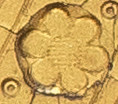

# punches_recognition
Repo for the paper "An Artificial Intelligence System for Automatic Recognition of Punches in Fourteenth-Century Panel Painting", currently under review @ IEEE Access.

This work is a proof of concept for applying automatic pattern recognition techniques as an aid to art historians operating in the field of panel painting analysis, to help them in analyzing and authenticating these works of art.

## What is a punch?

A punch is a decoration impressed with the usage of mechanical tools on the gold foil of a panel painting.
This type of decoration was very popular in Tuscany in the 13th and 14th century.
Art historian Erling S. Skaug was the first to propose the use of these marks as a cue towards establishing attributions of panel paintings to build connections between the different artists and workshops from that era.
His 30-years-long work consisted of carefully taking high-res pictures of the artworks, analyzing the punches with precision tools, and cataloguing his discoveries in several publications.

## What did we do?

Inspired by the work of Skaug, we study the possibility of automating his analysis to aid art historians working in the field of panel painting.
We wish to investigate whether there exist pattern recognition techniques able to reliably categorize the punches.
After taking pictures of some artworks, we build a small dataset of crops of punches.
We experiment with a **Convolutional Neural Network (CNN) for image classification** on these crops.
Moreover, since our dataset is nowhere near the whole collection of punches catalogued by Skaug, we wish to enhance our CNN with an additional module for uncertainty estimation, as classic CNNs are known to formulate high-confidence predictions even on random data (e.g., see [(2015, Nguyen et al.)](https://www.cv-foundation.org/openaccess/content_cvpr_2015/html/Nguyen_Deep_Neural_Networks_2015_CVPR_paper.html)).
We experiment with two techniques:

* II-loss, from [(2020, Hassen & Chan)](https://epubs.siam.org/doi/abs/10.1137/1.9781611976236.18)
* OpenGAN, from [(2021, Kong & Ramanan)](https://openaccess.thecvf.com/content/ICCV2021/html/Kong_OpenGAN_Open-Set_Recognition_via_Open_Data_Generation_ICCV_2021_paper.html)

Our results indicate that CNNs perform well even with the addition of the uncertainty modules, thus providing an indication that our tool might be suited for the use by art historians, although additional experimentations with additional data are needed.

## Usage

Prerequisites:
* Python >= 3.8
* PyTorch >= 1.10
* torchvision >= 0.11
* PIL >= 8.4

### Dataset

Download the dataset from [this link](https://drive.google.com/drive/folders/1-dL-DTkdN1FTt-nBYEqgAScSZsp-_8jX?usp=sharing).

### Training

#### CNN for image classification

We use a resnet18 for image classification.

Run `python main_cnn.py --root_train <path of trainset> --root_test <path of testset> --model_path <save path for params>`.

Additional params are available (default are those provided in the paper). Run `python main_cnn.py --help` for additional info.

#### Uncertainty estimation via II-loss

II-loss is a cost function to be used in conjunction with cross-entropy for producing an intermediate embedding space in a regular neural network for classification.
The embedding space is such that points belonging to known classes gather in clusters, while points from unknown classes are (hopefully) projected outside these clusters.

The training phase produces this embedding space, although the uncertainty estimation is operated on the basis of the Outlier Scores (OS), calculated from the Euclidean norm between a given embedding and the cluster centroids,

To **train**, run `python main_ii.py --epochs 10 --delta_ii 0.5 --root_train <path of trainset> --root_test <path of testset> --model_path <save path for params> --alternate_backprop`.

Additional params are available (default are those provided in the paper). Run `python main_ii.py --help` for additional info. 

For instance, it is possible to load the parameters of the CNN trained for image classification as a starting point for the training of this network—as we have done in the paper—otherwise, by default, the ImageNet params are loaded.

To determine the OS, first calculate the OSs: `python ii_outscores.py --root_valid <path of valid data> --root_crops <path of crops data> --root_ood <path of OOD data> --pretrained_params_path <path of params of pretrained model w/II-loss> --base_path <base path where the scores will be saved>`.
If ran correctly, the OSs will be saved under `base_path_valid.pth`, `base_path_crops.pth`, `base_path_ood.pth`.

To determine the OS threshold, run `python determine_metrics.py --path_outlier_scores_<split> <path to OS of given split> --save_path <path of CSV results file>`. Repeat `--path_outlier_scores_<split>` for `split`="valid", "crops", "ood".

#### Uncertainty estimation via OpenGAN

We used GANs so that the Discriminator would be able to distinguish between real features and those generated by the Generator. The features are extracted from layer4 of ResNet18 trained with `main_cnn.py` via a hook function.

To train the GAN execute:
`! python main.py --name_modelpth <path of ResNet18's weight> --root_data <path of data> --epochs 900`

